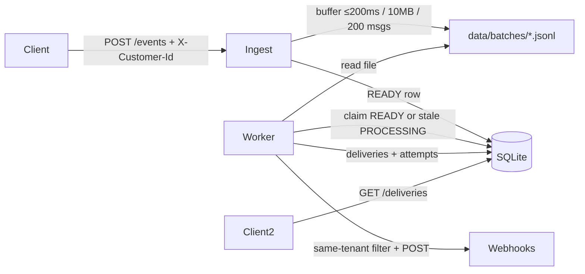

# Event Fanout Service

Multi-tenant event ingestion and webhook fanout service (Java 21 + Spring Boot 3.3 + SQLite).

Clients publish events; the service buffers them, persists sealed batches to disk, matches per-customer subscriptions, and delivers to webhooks with retries and an audit API.

**Project path:** `/workspaces/s-coding-interview/workspaces/event-fanout`

## Why this exists (production analogy)

This service is an **analogy-based illustration** of a real multi-tenant, SNS-style pub/sub + fanout system — not a production deployment itself.

We built it this way to show how the pieces of a distributed design map onto something you can run on one laptop:

| This demo | Production SNS-like system |
|-----------|----------------------------|
| Multiple worker processes / hosts (`WORKER_ID`, SQLite claim) | **Distributed hosts** competing to claim and process work |
| Local disk (`data/batches/*.jsonl` + fsync) | **Object storage (e.g. S3)** — durable sealed batches (**7+ nines** durability) |
| SQLite (batch lease, subscriptions, deliveries) | **NoSQL / managed store (e.g. DynamoDB)** — leases, metadata, delivery state |
| `X-Customer-Id` header | Real tenant auth (API keys / IAM) |
| In-process buffer + poll worker | Same in Production |

Same mental model: **ingest → durable batch → claim → filter by tenant/subscription → webhook deliver → audit**, scaled out across hosts with cloud durability and a shared metadata store.

## Architecture



| Stage | Behavior |
|-------|----------|
| **Ingest** | Events enter an in-memory buffer; flushed on **200ms**, **~10MB**, or **200 messages**. |
| **ACK** | `202` only after the batch file is **fsync’d** and registered in SQLite as `READY`. |
| **Worker** | Polls every ~500ms; claims up to **10** batches (`READY`, or `PROCESSING` older than **5s**). |
| **Fanout** | For each event × subscription: same `customerId` + filter match → HTTP POST webhook. |
| **Delivery** | One row per `(eventId, subscriptionId)`; retry up to **5** attempts; audit via `GET /deliveries`. |

**Delivery guarantee:** at-least-once per matching subscription (This happens because, we added a check where if a message didn't get processed in X Amount of Time (Visibility Timeout in real life), another process polls and does the processing). Downstream should dedupe on `deliveryId`.

## Multi-tenant

All subscription and event APIs require header **`X-Customer-Id`** (stand-in for API key → customer). Missing → `401`.

| Rule | Behavior |
|------|----------|
| Subscriptions | create / list / delete scoped to that customer |
| Events | stored with `customerId` from the header |
| Fanout | only same-customer subscriptions receive the event |
| Isolation | customer A never receives customer B’s events |

## Limits

| Limit | Value |
|-------|--------|
| Events per batch request | 100 |
| Payload size (JSON-serialized) | 64 KB |
| Buffer flush | 200ms / ~10MB / 200 messages |
| Webhook attempts | 5 |
| Stale batch reclaim | 5 seconds |

## APIs

| Method | Path | Purpose |
|--------|------|---------|
| `POST` | `/api/v1/events` | Single event |
| `POST` | `/api/v1/events/batch` | Batch (partial accept/reject) |
| `POST` | `/api/v1/subscriptions` | Register webhook + filter |
| `GET` | `/api/v1/subscriptions` | List (tenant-scoped) |
| `DELETE` | `/api/v1/subscriptions/{id}` | Delete (tenant-scoped) |
| `GET` | `/api/v1/deliveries?eventId=` | Audit by event |
| `GET` | `/api/v1/deliveries?subscriptionId=` | Audit by subscription |

### Filter syntax

```json
{
  "url": "http://localhost:9999/hook",
  "filter": {
    "types": ["order.*"],
    "sources": ["billing"],
    "payload": { "status": "paid" }
  }
}
```

Empty / missing filter fields match all. `types` / `sources` support simple `*` wildcards (e.g. `order.*`).

### Webhook body

```json
{
  "deliveryId": "<eventId>__<subscriptionId>",
  "eventId": "...",
  "type": "order.created",
  "source": "billing",
  "payload": { }
}
```

### Curl samples

```bash
# subscribe
curl -s -X POST localhost:8080/api/v1/subscriptions \
  -H 'X-Customer-Id: acme' \
  -H 'Content-Type: application/json' \
  -d '{"url":"http://127.0.0.1:9999/hook","filter":{"types":["order.*"],"sources":["billing"]}}'

# list (acme only)
curl -s localhost:8080/api/v1/subscriptions -H 'X-Customer-Id: acme'

# send event
curl -s -X POST localhost:8080/api/v1/events \
  -H 'X-Customer-Id: acme' \
  -H 'Content-Type: application/json' \
  -d '{"type":"order.created","source":"billing","payload":{"status":"paid"}}'

# audit
curl -s 'localhost:8080/api/v1/deliveries?eventId=<id>'
```

## Run locally

Requires Java 21. This repo vendors Maven under `./apache-maven-3.9.6` and a local `./.m2`.

```bash
cd /workspaces/s-coding-interview/workspaces/event-fanout

# start API (port 8080)
./apache-maven-3.9.6/bin/mvn -Dmaven.repo.local=./.m2 spring-boot:run

# tests
./apache-maven-3.9.6/bin/mvn -Dmaven.repo.local=./.m2 test

# load / correctness soak only (~1–2 min)
./apache-maven-3.9.6/bin/mvn -Dmaven.repo.local=./.m2 -Dtest=MultiTenantLoadIT test
```

Data directory: `./data` (`fanout.db`, `batches/*.jsonl`).

Optional: `WORKER_ID=host-a` to label the claiming worker.

If you have an older DB from before `customer_id`, delete `data/fanout.db` (or rely on `DbInit`’s `ALTER TABLE`).

## Package layout

```text
com.eventfanout
├── api/           Controllers, CustomerAuth, exception handler
├── ingest/        EventBuffer (flush + shutdown dump)
├── worker/        BatchWorker (claim, filter, HTTP delivery)
├── store/         DbInit, SubscriptionStore, BatchRecovery
├── match/         FilterMatcher
└── config/        RestClient
```

## Tests

| Suite | What it covers |
|-------|----------------|
| Unit / slice (`*Test`) | Controllers, buffer, matcher, store, worker |
| `FanoutIntegrationTest` | Full path: subscribe → ingest → deliver → audit; list is tenant-scoped |
| `MultiTenantLoadIT` | **10K events × 5 customers**: durable ingest, filter skip, isolation, drain, at-least-once |

Load test expectations:

- 2,000 events per customer (every 10th is non-matching `user.created`)
- **9,000** `DELIVERED` rows; **0** cross-tenant webhook hits
- All batches `DONE`; **10,000** JSONL lines on disk

## Design tradeoffs / next steps

| Now | Next |
|-----|------|
| `X-Customer-Id` header (demo auth) | Real API keys / JWT |
| Shared disk + SQLite claim | Kafka / queue + managed DB |
| At-least-once | Stronger dedupe / fencing |
| Poll READY batches | Notify worker on flush |
| Single-node demo | Multi-host + shared storage |

Not implemented: ordering guarantees, replay API, DigitalOcean Kafka/Spaces deploy.
