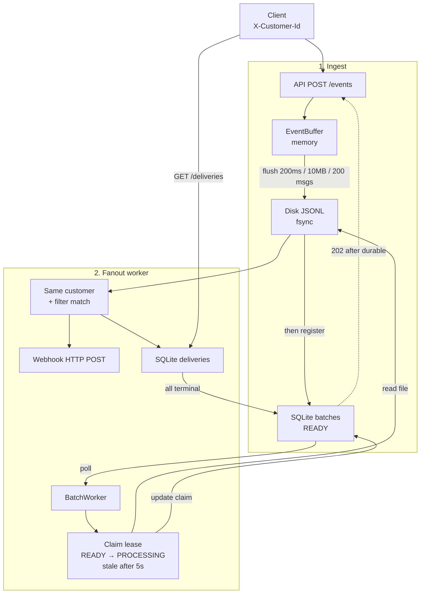

# Event Fanout Service

Multi-tenant event ingestion and webhook fanout (Java 21 + Spring Boot 3.3 + SQLite).

Clients publish events; the service buffers them, seals batches to disk, matches per-customer subscriptions, and delivers to webhooks with retries and an audit API.

## Why this exists

This is an **analogy-based illustration** of a multi-tenant, SNS-style pub/sub + fanout system — not a production deployment. It maps a distributed design onto something you can run on one laptop:

| This demo | Production SNS-like system |
|-----------|----------------------------|
| Multiple workers (`WORKER_ID` + SQLite claim) | **Distributed hosts** competing for work |
| Local disk (`data/batches/*.jsonl` + fsync) | **Object storage (e.g. S3)** — sealed batches, **7+ nines** durability |
| SQLite (leases, subscriptions, deliveries) | **NoSQL store (e.g. DynamoDB)** — metadata + delivery state |
| `X-Customer-Id` header | Real tenant auth (API keys / IAM) |
| In-process buffer + poll worker | Same pattern in production (ingest buffer → async workers) |

**Mental model:** ingest → durable batch → claim → tenant/filter match → webhook → audit.

## Architecture



### Lifecycle

| Stage | What happens |
|-------|----------------|
| **Buffer** | Events sit in memory until **200ms**, **~10MB**, or **200 messages**. |
| **ACK** | `202` only after **fsync** of the JSONL file **and** a `READY` row in SQLite (disk first, metadata second). |
| **Claim** | Workers poll ~500ms, take up to **10** batches that are `READY` or `PROCESSING` older than **5s** (visibility-timeout reclaim). |
| **Fanout** | For each event × subscription: same `customerId` + filter match → HTTP POST. |
| **Delivery** | One row per `(eventId, subscriptionId)`; up to **5** attempts; audit via `GET /deliveries`. |

**Guarantee:** at-least-once per matching subscription. If a host dies mid-batch, another worker reclaims after **5s**. Downstream should dedupe on `deliveryId`.

## Multi-tenant

Every subscription and event API requires **`X-Customer-Id`**. Missing → `401`.

| Rule | Behavior |
|------|----------|
| Subscriptions | create / list / delete scoped to that customer |
| Events | stored with `customerId` from the header |
| Fanout | only same-customer subscriptions receive the event |
| Isolation | customer A never receives customer B’s events |

## Limits

| Limit | Value |
|-------|--------|
| Events per batch request | 100 |
| Payload size (JSON-serialized) | 64 KB |
| Buffer flush | 200ms / ~10MB / 200 messages |
| Webhook attempts | 5 |
| Stale batch reclaim | 5 seconds |

## APIs

| Method | Path | Purpose |
|--------|------|---------|
| `POST` | `/api/v1/events` | Single event |
| `POST` | `/api/v1/events/batch` | Batch (partial accept/reject) |
| `POST` | `/api/v1/subscriptions` | Register webhook + filter |
| `GET` | `/api/v1/subscriptions` | List (tenant-scoped) |
| `DELETE` | `/api/v1/subscriptions/{id}` | Delete (tenant-scoped) |
| `GET` | `/api/v1/deliveries?eventId=` | Audit by event |
| `GET` | `/api/v1/deliveries?subscriptionId=` | Audit by subscription |

### Filter

```json
{
  "url": "http://localhost:9999/hook",
  "filter": {
    "types": ["order.*"],
    "sources": ["billing"],
    "payload": { "status": "paid" }
  }
}
```

Empty / missing fields match all. `types` / `sources` support simple `*` wildcards.

### Webhook payload

```json
{
  "deliveryId": "<eventId>__<subscriptionId>",
  "eventId": "...",
  "type": "order.created",
  "source": "billing",
  "payload": { }
}
```

### Curl

```bash
# subscribe
curl -s -X POST localhost:8080/api/v1/subscriptions \
  -H 'X-Customer-Id: acme' \
  -H 'Content-Type: application/json' \
  -d '{"url":"http://127.0.0.1:9999/hook","filter":{"types":["order.*"],"sources":["billing"]}}'

# list (acme only)
curl -s localhost:8080/api/v1/subscriptions -H 'X-Customer-Id: acme'

# send event
curl -s -X POST localhost:8080/api/v1/events \
  -H 'X-Customer-Id: acme' \
  -H 'Content-Type: application/json' \
  -d '{"type":"order.created","source":"billing","payload":{"status":"paid"}}'

# audit
curl -s 'localhost:8080/api/v1/deliveries?eventId=<id>'
```

## CI

GitHub Actions (`.github/workflows/ci.yml`) runs on every push/PR to `main`:

- Java 21 (Temurin) + Maven
- `mvn -B test` — unit, integration, and `MultiTenantLoadIT`
- Surefire reports uploaded if the job fails

## Run locally

Requires **Java 21** and **Maven 3.9+**.

```bash
# start (port 8080)
mvn spring-boot:run

# unit + integration tests
mvn test

# load / correctness soak only (~1–2 min)
mvn -Dtest=MultiTenantLoadIT test
```

Data: `./data/fanout.db` and `./data/batches/*.jsonl` (gitignored).

Optional: `WORKER_ID=host-a` to label the claiming worker.

If the DB predates `customer_id`, delete `data/fanout.db` (or rely on `DbInit`’s `ALTER TABLE`).

## Package layout

```text
com.eventfanout
├── api/      Controllers, CustomerAuth, exception handler
├── ingest/   EventBuffer (flush + shutdown dump)
├── worker/   BatchWorker (claim, filter, HTTP delivery)
├── store/    DbInit, SubscriptionStore, BatchRecovery
├── match/    FilterMatcher
└── config/   RestClient
```

## Tests

| Suite | Covers |
|-------|--------|
| Unit / slice (`*Test`) | Controllers, buffer, matcher, store, worker |
| `FanoutIntegrationTest` | Subscribe → ingest → deliver → audit; tenant-scoped list |
| `MultiTenantLoadIT` | **10K events × 5 customers**: durability, filters, isolation, drain, at-least-once |

Load test checks:

- 2,000 events/customer (every 10th is non-matching `user.created`)
- **9,000** `DELIVERED` rows; **0** cross-tenant webhook hits
- All batches `DONE`; **10,000** JSONL lines on disk

## Tradeoffs / next steps

| Now | Next |
|-----|------|
| `X-Customer-Id` demo auth | API keys / JWT |
| Shared disk + SQLite claim | Kafka / queue + managed DB |
| At-least-once + 5s reclaim | Heartbeat leases, stronger fencing |
| Poll READY batches | Notify worker on flush |
| Single-node demo | Multi-host + shared object store |
| Imperative / mutable style | More **functional** pipelines + **immutability** (see below) |

Not implemented: ordering guarantees, replay API, cloud deploy (e.g. DO Kafka / Spaces).

### Code readability (functional + immutable)

The current code favors straightforward imperative Spring/Java for interview speed. We can improve readability and reasoning about concurrency by:

- **Functional programming** — express fanout/filter/retry as small composed steps (e.g. stream/map/filter over events × subscriptions) instead of nested loops and mutable accumulators.
- **Immutability** — prefer records / unmodifiable maps for events, deliveries, and filter results so worker threads share snapshots safely and side effects stay at the edges (DB, HTTP, disk).

That keeps the same architecture while making the “what happens to each event” path easier to follow.
